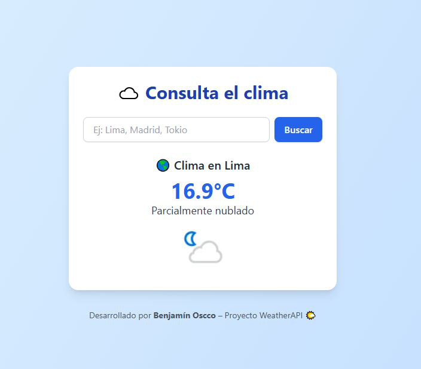

# 🌤️ WeatherAPI Flask App

Aplicación web simple desarrollada con **Flask** para consultar el clima actual de cualquier ciudad usando la API de [WeatherAPI](https://www.weatherapi.com/).



---

## 🚀 ¿Qué hace este proyecto?

- Consulta el clima actual en tiempo real.
- Muestra la temperatura en °C, estado del cielo y un ícono del clima.
- Interfaz moderna responsive con TailwindCSS.
- Manejo de errores si la ciudad no es encontrada.

---

## 🧱 Tecnologías usadas

- Python 3
- Flask
- WeatherAPI (freemium)
- TailwindCSS CDN

---

## 📂 Estructura del proyecto

```
weather-flask-app/
├── app.py
├── requirements.txt
├── templates/
│   └── index.html
└── static/
    └── (opcional para íconos o futuros estilos)
```

---

## ⚙️ Cómo usarlo

1. Crea un entorno virtual (opcional pero recomendado):

```bash
python -m venv venv
source venv/bin/activate  # Linux/macOS
venv\Scripts\activate   # Windows
```

2. Instala dependencias:

```bash
pip install -r requirements.txt
```

3. Ejecuta la app:

```bash
python app.py
```

4. Abre en el navegador:

```
http://127.0.0.1:5000
```

---

## 🔐 Clave de API

Este proyecto usa [WeatherAPI](https://www.weatherapi.com/).  
Regístrate y copia tu clave gratuita. Luego reemplaza el valor en `app.py`:

```python
API_KEY = "TU_API_KEY_AQUI"
```

---

## 📸 Captura de pantalla


---

## 📄 Licencia

MIT License

---

Desarrollado por **Benjamín Oscco** 🇵🇪 – Proyecto 7 / GitHub Portfolio